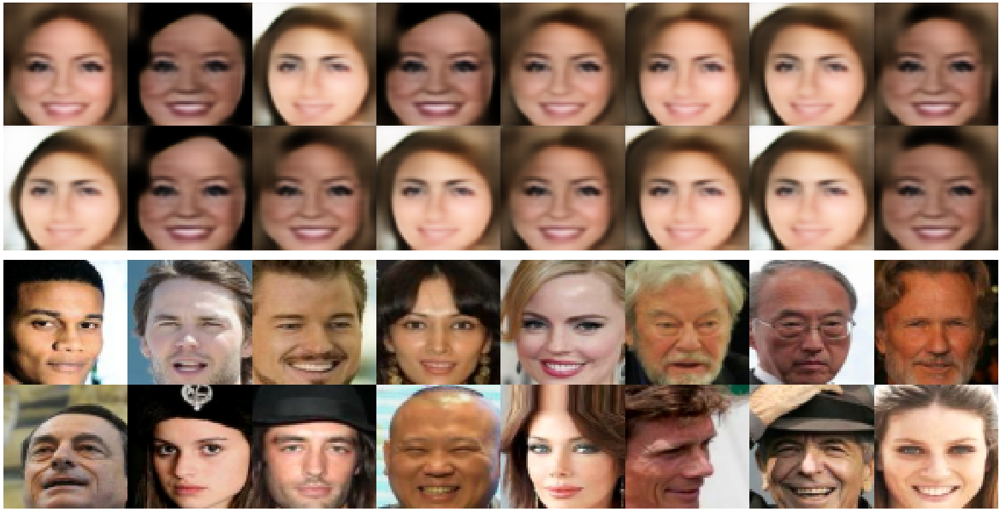
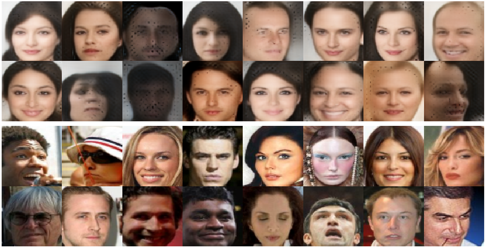

# BEGAN

Tensorflow implementation of BEGAN.

**Sources:**

- [BEGAN](https://arxiv.org/pdf/1703.10717.pdf)

# Requirements

## python modules

    pip install -r requirements.txt

should install all the necessary dependencies.

# Part 1. Getting the data

- Go to http://mmlab.ie.cuhk.edu.hk/projects/CelebA.html
- In the Downloads section, select Align&Cropped images.
- In the dropbox page that follows, download the Anno, Eval and Img folders.
- Copy these folders to `/data/raw`.
- Extract the zip files.

We are only going to use the images

# Part 2. Running the code

Follow [these instructions](https://github.com/tdeboissiere/DeepLearningImplementations/tree/master/BEGAN/src/model)

# Part 3. Example results

**CelebA example results**

- The first 2 rows are generated images
- The last 2 rows are real images

