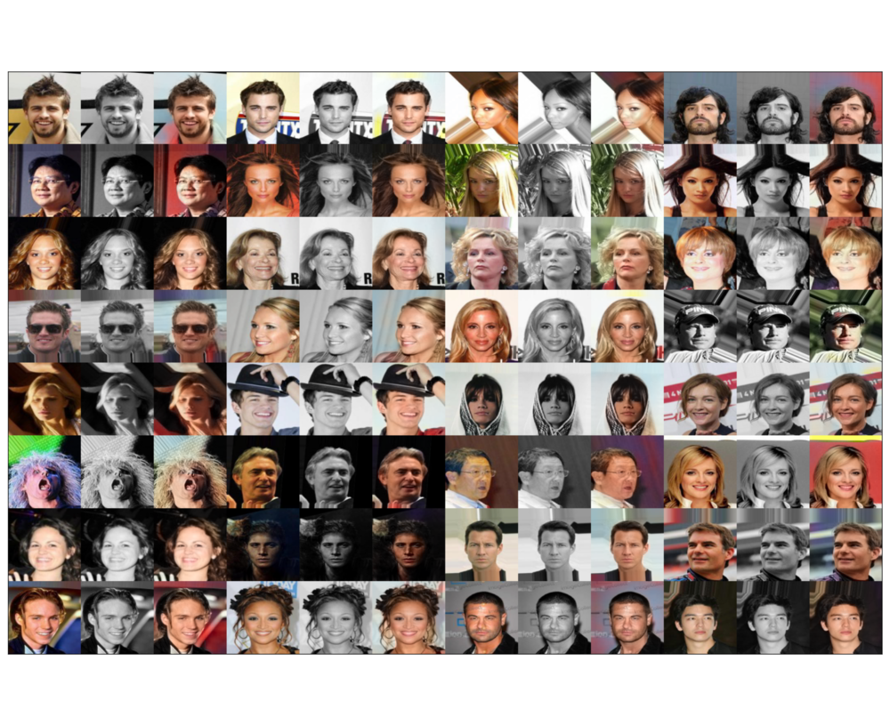

# Colorful

Keras implementation of [Colorful Image Colorization](https://arxiv.org/abs/1603.08511) by Richard Zhang, Phillip Isola and Alexei A. Efros

The technique is applied on the [CelebA dataset](http://mmlab.ie.cuhk.edu.hk/projects/CelebA.html) with minor modifications.

# Requirements

## python modules

- keras, theano backend
- h5py
- matplotlib
- scikit-learn
- scikit-image
- opencv 3
- numpy
- scipy
- tqdm

## System requirements

- Nvidia GPU with at least 2GB RAM
- At least 4GB RAM (when using the on_demand option for training)

The settings above should work well enough for small image size (32 x 32).
Above that, better GPU and more RAM are required.

# Part 1. Processing the data

Follow [these instructions](https://github.com/tdeboissiere/DeepLearningImplementations/tree/master/Colorful/src/data).

# Part 2. Running the code

Follow [these instructions](https://github.com/tdeboissiere/DeepLearningImplementations/tree/master/Colorful/src/model)

# Part 3. Example results

For each triplet:

- First column is the original
- Second column is the B&W version
- Last column is the colorized output

# Part 4. Live colorization with webcam

Follow [these instructions](https://github.com/tdeboissiere/DeepLearningImplementations/tree/master/Colorful/src/app)