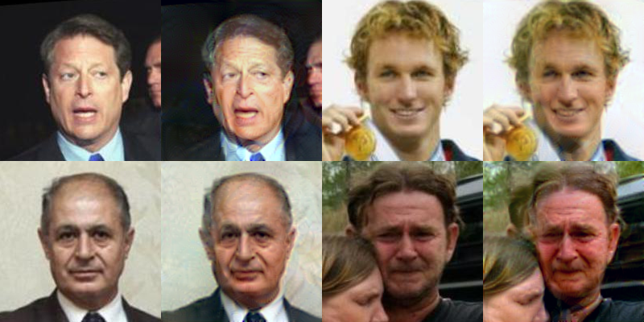

# DFI

Keras implementation of [Deep Feature Interpolation for Image Content Changes](https://arxiv.org/pdf/1611.05507v1.pdf) by Paul Upchurch, Jacob Gardner, Kavita Bala, Robert Pless, Noah Snavely, Kilian Weinberger

The technique is applied on the [LFW](http://vis-www.cs.umass.edu/lfw/) with minor modifications.

# Requirements

## python modules

- keras, theano backend
- h5py
- matplotlib
- scikit-learn
- pandas
- opencv 3
- numpy
- scipy
- tqdm
- parmap

## keras repo

Make sure to clone this repo: https://github.com/fchollet/deep-learning-models for easy access to the VGG19 model.

# Part 1. Processing the data

Follow [these instructions](https://github.com/tdeboissiere/DeepLearningImplementations/tree/master/DFI/src/data).

# Part 2. Running the code

Follow [these instructions](https://github.com/tdeboissiere/DeepLearningImplementations/tree/master/DFI/src/model)

# Part 3. Example results

For each pair:

- First column is the original
- Second column is the aged original