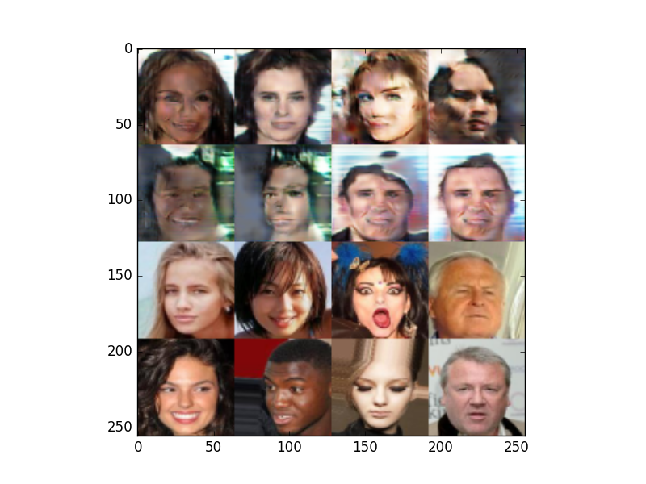
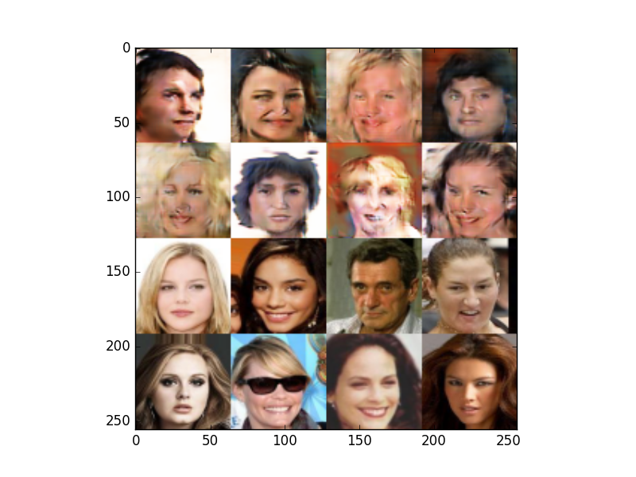
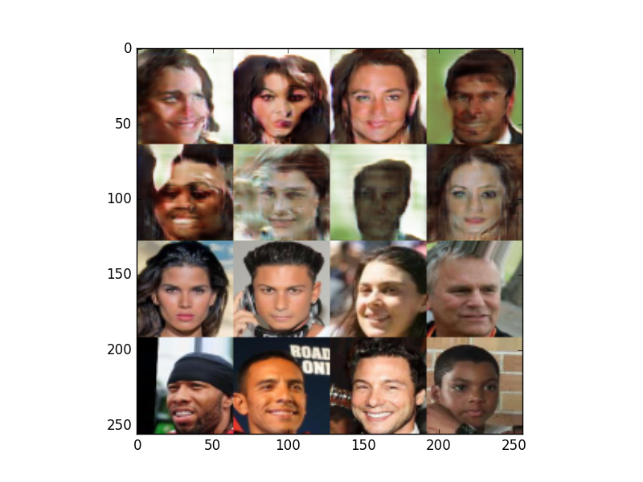
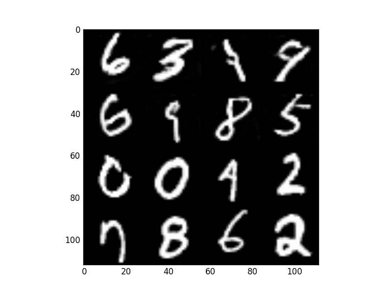
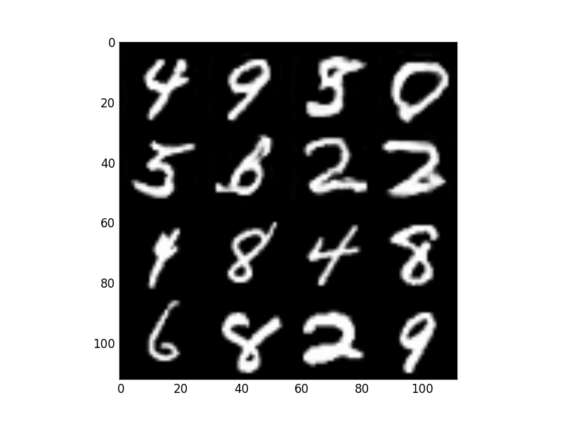

# Generative Adversarial Networks

Keras implementation of some GAN models.

**Sources:**

- [Improved Techniques for Training GANs](https://arxiv.org/abs/1606.03498)
- [Unsupervised Representation Learning with Deep Convolutional Generative Adversarial Networks](https://arxiv.org/abs/1511.06434)
- [GANHacks](https://github.com/soumith/ganhacks)

# Requirements

## python modules

- tqdm==4.17.0
- opencv_python==3.3.0.10
- numpy==1.13.3
- matplotlib==2.0.2
- Keras==2.0.8
- Theano==0.9.0 or Tensorflow==1.3.0
- h5py==2.7.0
- parmap==1.5.1

# Part 1. Processing the data

Follow [these instructions](https://github.com/tdeboissiere/DeepLearningImplementations/tree/master/GAN/src/data).

# Part 2. Running the code

Follow [these instructions](https://github.com/tdeboissiere/DeepLearningImplementations/tree/master/GAN/src/model)

# Part 3. Example results

**CelebA example results**

**MNIST example results**

For each image:

- The first 2 rows are generated images
- The last 2 rows are real images
