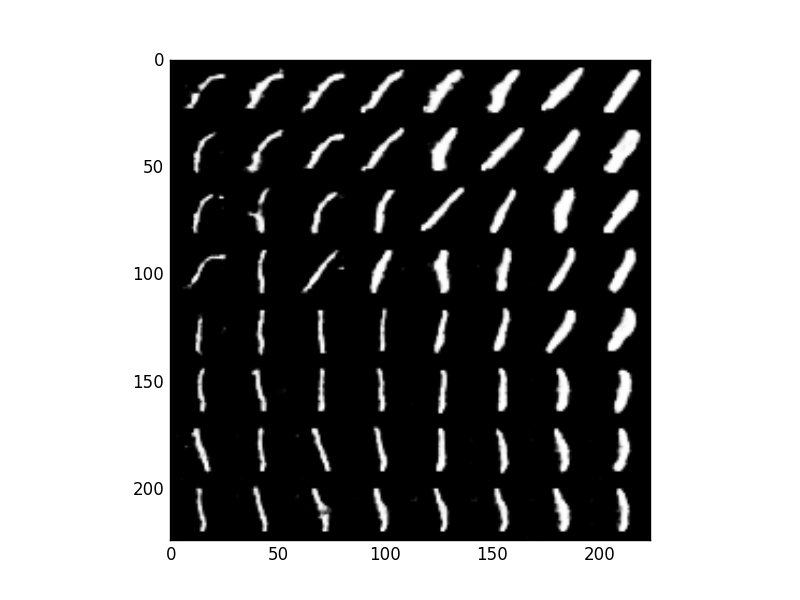

# InfoGAN

Keras implementation of [InfoGAN: Interpretable Representation Learning by Information Maximizing Generative Adversarial Nets](https://arxiv.org/abs/1606.03657)

# Requirements

## python modules

- keras, theano or tensorflow backend
- h5py
- matplotlib
- opencv 3
- numpy
- tqdm
- parmap

# Part 1. Processing the data

Follow [these instructions](https://github.com/tdeboissiere/DeepLearningImplementations/tree/master/InfoGAN/src/data).

# Part 2. Running the code

Follow [these instructions](https://github.com/tdeboissiere/DeepLearningImplementations/tree/master/InfoGAN/src/model)

# Part 3. Example results

**MNIST example results**

**Note 1** The figures below were obtained with a slight modification of the original InfoGAN paper: supervised categorical cross entropy loss for the discriminator and simple MSE loss for the continuous variables. Credits to [@burisuriburi](https://github.com/buriburisuri/supervised_infogan) for the original idea.

**Note 2** The code in this repository matches OpenAI's original implementation, without the trick of Note 1.

Varying the categorical code along each row:

Varying the continuous code along rows and columns:

