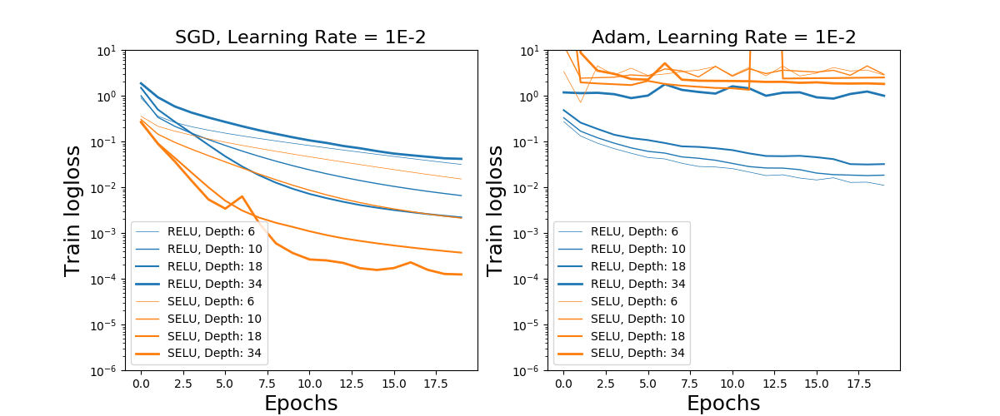
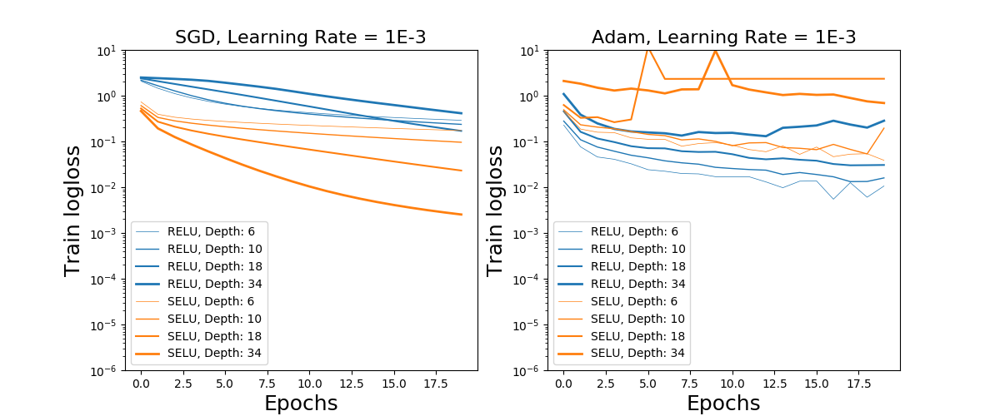
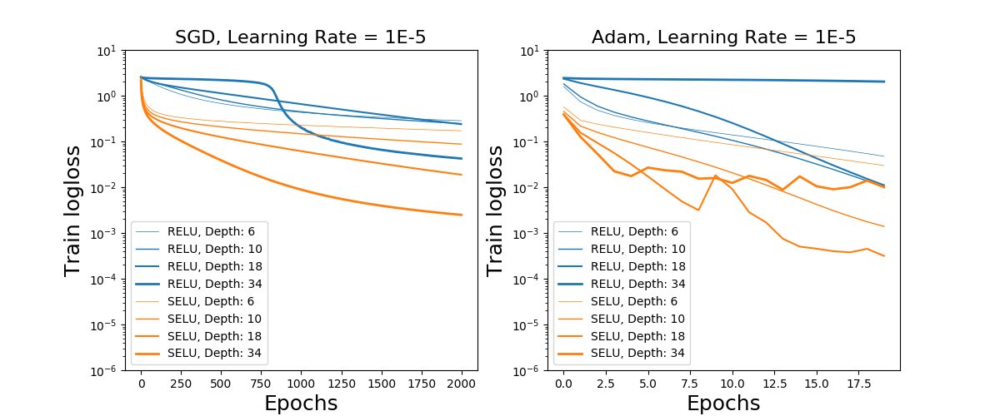

# Experiments with MNIST and SELU

Pytorch implementation of some experiments from [Self-Normalizing Networks](https://arxiv.org/pdf/1706.02515.pdf)

## Dependencies

- python (tested on Anaconda python 3.6.1)
- pytorch (tested on 0.1.12_2)
- sklearn (tested on 0.18.1)
- matplotlib (tested on 2.0.1)
- tqdm
- numpy

## Uage

Main command:

	python main.py

Arguments:

	  --model MODEL         Model name, RELUNet or SELUNet
	  --n_inner_layers N_INNER_LAYERS
	                        Number of inner hidden layers
	  --hidden_dim HIDDEN_DIM
	                        Hidden layer dimension
	  --dropout DROPOUT     Dropout rate
	  --use_cuda            Use CUDA
	  --nb_epoch NB_EPOCH   Number of training epochs
	  --batchnorm           Whether to use BN for RELUNet
	  --batch_size BATCH_SIZE
	                        Batch size
	  --optimizer OPTIMIZER
	                        Optimizer
	  --learning_rate LEARNING_RATE
	                        Learning rate

## Run a batch of experiments

Modify `run_experiments.sh` as needed then run

	bash run_experiments.sh

## Plot results

Run a few experiments. Results are saved in a `results` folder.
Modify `plot_results.py` to select your experiments, then run:

	python plot_results.py

## Results

- The architecture of the NN is the same as in the original paper.
- The depths are a bit different (powers of 2 for inner layers, not counting first and last layer)
- N.B. The number of epochs vary between plots.
- At LR = 1E-5, the results are consistent with the paper albeit the minimum training loss is quite a bit higher than in the paper.
- The Adam optimizer was also used (far less epochs though) for comparison. SELU still seems to work better but is more unstable
- At higher learning rates, Adam no longer works really well for SELU. (Note that the conclusion may change with more epochs but 2000 epochs is quite a lot of time...)

## Conclusion

- SELU is definitely better behaved with SGD.
- Depending on learning rate, it may also be better with Adam.
- However a fair bit of fine tuning seems to be needed to get best performance (even with SGD) and training may be quite slow (lots of epochs needed for low learning rate).