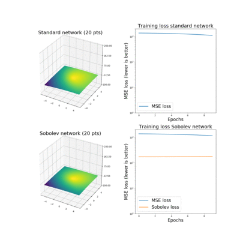
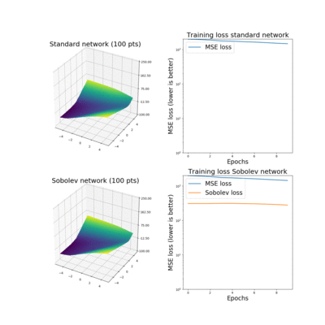

# Sobolev training for neural networks

theano + lasagne implementation of [Sobolev Training for Neural Networks](https://arxiv.org/abs/1706.04859)

## Dependencies

- Lasagne==0.2.dev1
- Theano==0.9.0
- numpy==1.13.3
- tqdm==4.17.0
- natsort==5.1.0
- matplotlib==2.0.2

## Uage

Main command:

	python main,py

Arguments:

	--nb_epoch NB_EPOCH   Number of training epochs
	--batch_size BATCH_SIZE
	                      Batch size
	--npts NPTS         Number of training points
	--learning_rate LEARNING_RATE
	                      Learning rate
	--sobolev_weight SOBOLEV_WEIGHT
	                      How much do we weight the Sobolev function

## Run a batch of experiments

	bash run_experiments.sh

## Create gif

	bash run_experiments
	python make_gif.py

## Notes

- The architecture of the NN is the same as in the original paper.
- We plot the loss curves to give some more perspective.
- Initially had a hard time reproducing results. Inspection of loss curves show you just have to train longer until Soboleb loss and MSE loss have similar magnitude. Or increase the weight on the Sobolev loss.
