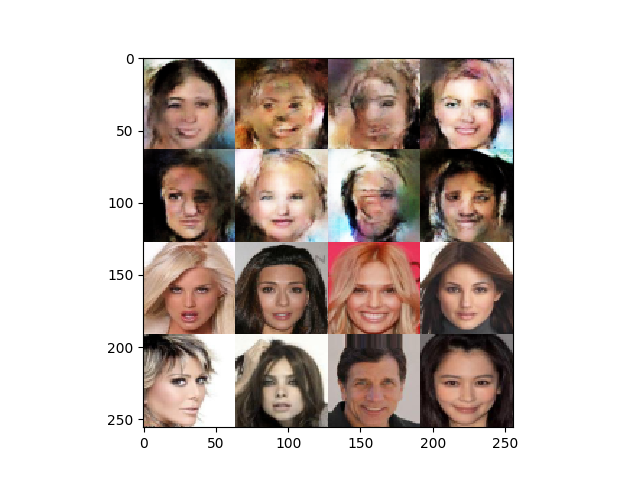
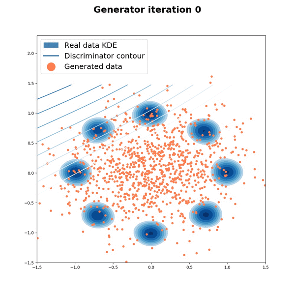

# Generative Adversarial Networks

Keras implementation of WassersteinGAN.

**Sources:**

- [Wasserstein GAN](https://arxiv.org/abs/1701.07875)

# Requirements

## python modules

numpy==1.13.3
natsort==5.1.0
matplotlib==2.0.2
opencv_python==3.3.0.10
scipy==1.0.0
tqdm==4.17.0
Keras==2.0.8
parmap==1.5.1
h5py==2.7.0
Theano==0.9.0 or tensorflow==1.3.0

# Part 1. Processing the data

Follow [these instructions](https://github.com/tdeboissiere/DeepLearningImplementations/tree/master/WassersteinGAN/src/data).

# Part 2. Running the code

Follow [these instructions](https://github.com/tdeboissiere/DeepLearningImplementations/tree/master/WassersteinGAN/src/model)

# Part 3. Example results

**CelebA example results**

For each image:

- The first 2 rows are generated images
- The last 2 rows are real images

**MoG**

Results on the unrolled GAN paper to dataset:

