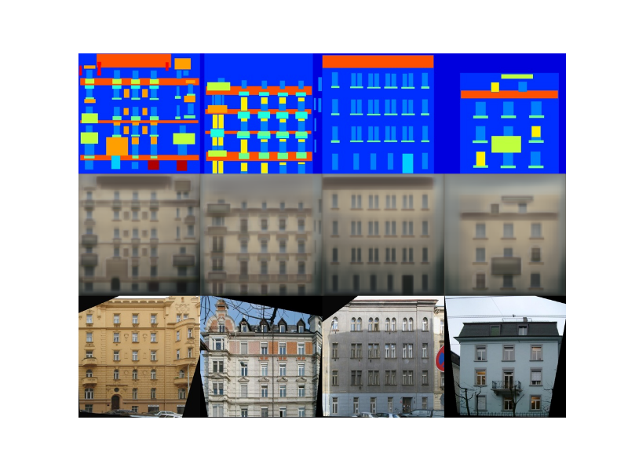

# pix2pix

Keras implementation of [Image-to-Image Translation with Conditional Adversarial Networks](https://arxiv.org/pdf/1611.07004v1.pdf) by Phillip Isola, Jun-Yan Zhu, Tinghui Zhou, Alexei A. Efros

# Requirements

## python modules

- numpy==1.13.3
- Keras==2.0.8
- parmap==1.5.1
- matplotlib==2.0.2
- tqdm==4.17.0
- opencv_python==3.3.0.10
- h5py==2.7.0
- theano==0.9.0 or tensorflow==1.3.0

# Part 1. Processing the data

Follow [these instructions](https://github.com/tdeboissiere/DeepLearningImplementations/tree/master/pix2pix/src/data).

# Part 2. Running the code

Follow [these instructions](https://github.com/tdeboissiere/DeepLearningImplementations/tree/master/pix2pix/src/model)

# Part 3. Example results

**Facade example results (validation set)**

For each image:

- The first row is the generator input
- The second row is the generator output
- The last row is the original image 
